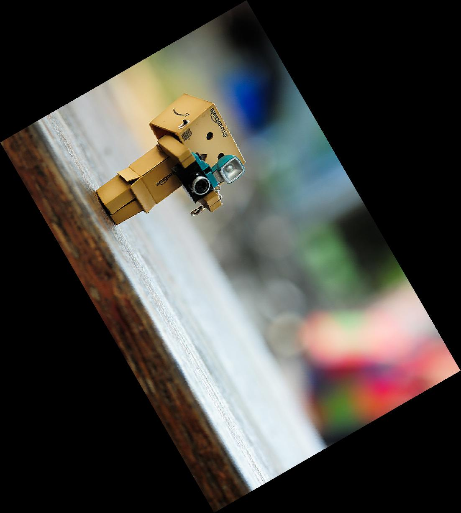

# Your Name <span style="color:red">(102061148)</span>

# Project 1 / Image Filtering and Hybrid Images

## Overview
>The project is related to basic image processing such as gray scale image, image flipping and image rotation. Although there might be some built-in functions which supports these tasks, we implement them to practice how to perform basic image processing using matlab.


## Implementation
1. **Gray scale:**

	* Read in the three channels of the input image:
		```
	R = I(:,:,1);
	G = I(:,:,2);
	B = I(:,:,3);
		```
	* Instead of iterating through the whole image, we can use directly sum up the R, G, B chaanels by multiplying 0.299, 0.587, 0.114 seperately. In the end, we save the result to the three channels of the output:
		```
	Y = (double(R)*0.299 + double(G)*0.587 + double(B)*0.114)/255;

	I_grey(:,:,1) = Y;
	I_grey(:,:,2) = Y;
	I_grey(:,:,3) = Y;
		```

2. **Image flipping:**

	* Read in the three channels of the input image:
		```
	R = I(:,:,1);
	G = I(:,:,2);
	B = I(:,:,3);
		```

	* According to the input type, we should implement three different flipping type (horizontally, vertically and both). Take type==0 as example, We first declare the output image:
		```
		R_flip = zeros(height,width);
    G_flip = zeros(height,width);
    B_flip = zeros(height,width);
		```

	* Then, we iterate through the whole image and assign each pixel to the correct location:
		```
		for h = 1 : height
       	for w = 1 : width
            	R_flip(h, w) =R(h, width-w+1);
            	G_flip(h, w) =G(h, width-w+1);
            	B_flip(h, w) =B(h, width-w+1);
       	end
    end
		```
	* Before return the image, we must convert the double type image content to the range of 0~1 so that imshow can display it properly:
		```
		I_flip(:,:,1) = R_flip/255;
    I_flip(:,:,2) = G_flip/255;
    I_flip(:,:,3) = B_flip/255;
		```
3. **Image rotation:**

	* At first, we convert the image to type double ranging 0~1 and read in the three channels seperately:
		```
		I = im2double(I);
R(:,:) = I(:,:,1);
G(:,:) = I(:,:,2);
B(:,:) = I(:,:,3);
		```

	* Then, we implement the conversion matrix and use it to find the new vertexes:

		```
		matrix = [cos(radius) -sin(radius) ; sin(radius) cos(radius)];
	vertex = [1 width 1 width;1 1 height height];
	vertex_new = matrix*vertex;
		```

	* After converting to the new coordinate, we find the new image boundary and how many pixels we should shift to keep good alignment of the new image:

		```
		min_x = min(vertex_new(1,:));
	max_x = max(vertex_new(1,:));
	min_y = min(vertex_new(2,:));
	max_y = max(vertex_new(2,:));

	x_shift = 1-min_x;
	y_shift = 1-min_y;

	width_new = ceil(max_x) - floor(min_x);
	height_new = ceil(max_y) - floor(min_y);
		```

	* Now we have the boundary of the new image. Next step is fill each pixel with the correct value. here we adapt back-warping method:

		1. Find the corresponding place of the pixels in the old image. It a reverse process of rotation:

			```
			matrix2 = [cos(-radius) -sin(-radius) ; sin(-radius) cos(-radius)];
		old= matrix2*[x_new-x_shift;y_new-y_shift];
		x_old = old(1);
		y_old = old(2);
			```

		2. This process won't be a pixel-to-pixel mapping, Instead, we need to find the pixels around the mapping location and perform interpolation:

			```
		x1 = floor(x_old);
    x2 = ceil(x_old);
    y1 = floor(y_old);
    y2 = ceil(y_old);
			```
			```
			if x1==x2
      		wa =1;
    	else
      		wa = (x_old - x1)/(x2-x1);
    	end
    	if y1==y2
      		wb = 1;
    	else
      		wb = (y_old - y2)/(y2-y1);
    	end
			```
 			```
			%calculate weight w1, w2 w3, w4 for 4 neighbor pixels.
    w1 = (1-wa)*(1-wb);
    w2 = wa*(1-wb);
    w3 = wa*wb;
    w4 = (1-wa)*wb;
		%calculate r,g,b with 4 neighbor point and their weight
    r=R(y1,x1)*w1 + R(y2,x1)*w2 + R(y1,x2)*w3 + R(y2,x2)*w4;
    g=G(y1,x1)*w1 + G(y2,x1)*w2 + G(y1,x2)*w3 + G(y2,x2)*w4;
    b=B(y1,x1)*w1 + B(y2,x1)*w2 + B(y1,x2)*w3 + B(y2,x2)*w4;
			```

## Installation

* Prerequisite:

	Matlab

* How to run:

	Enter this homework root:
	```
	>>> Lab5
	```

### Results

<table border=1>
 	<tr>
 		<th>Input image</th>
		<th>Gray scale image</th>
	</tr>
	<tr>
		<th></th>
		<th></th>
	</tr>

<table border=1>
	<tr>
		<th>Input image</th>
		<th>Horizontally flipped image</th>
	</tr>
	<tr>
 		<th></th>
		<th></th>
	</tr>
	<tr>
 		<th>Vertically flipped image</th>
		<th>Both direction flipped image</th>
	</tr>
	<tr>
 		<th></th>
		<th></th>
	</tr>

<table border=1>
	<tr>
		<th>Input image</th>
		<th>Rotated image</th>
	</tr>
	<tr>
		<th></th>
		<th></th>
	</tr>
